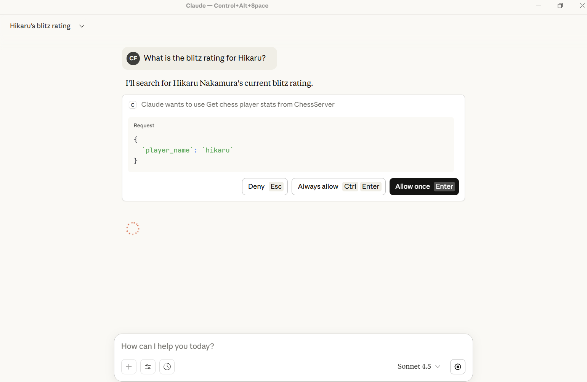
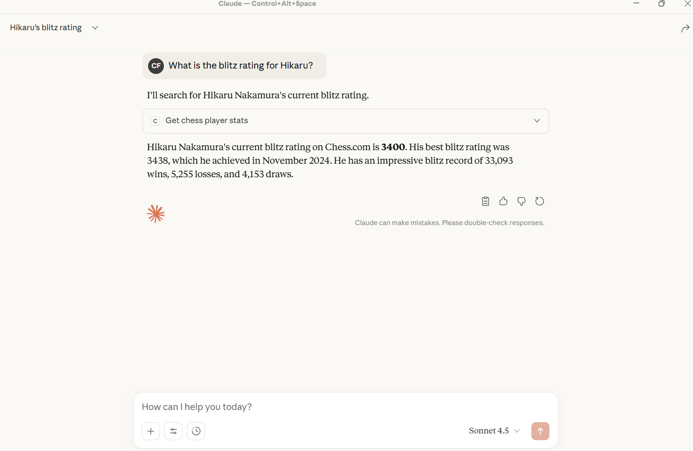
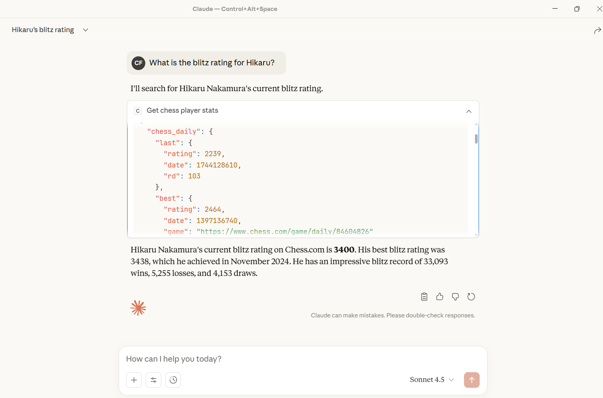
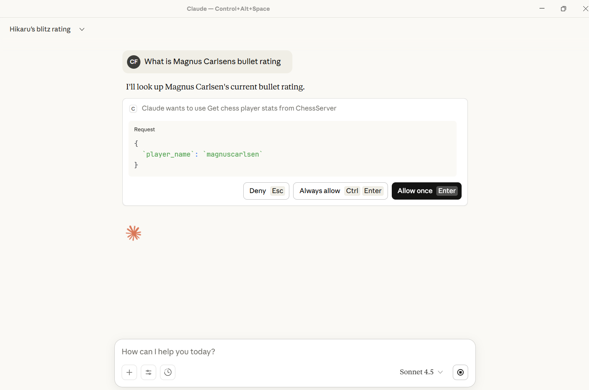
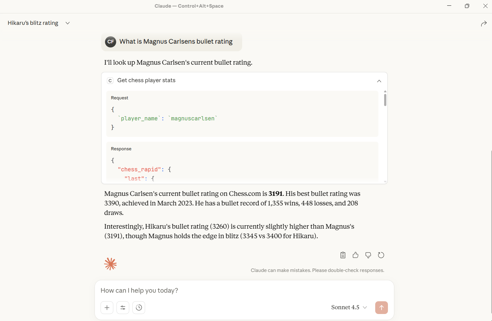

<div align="center">
  <strong></strong>

  # MCP Chess Server

  _By **BINATI AInalytics**_
</div>


A Model Context Protocol (MCP) server that provides Chess.com player data integration. This server allows AI assistants like Claude to fetch real-time chess player profiles and statistics from Chess.com's public API.


## Screenshots







## Features

- **Player Profile Lookup**: Get detailed profile information for any Chess.com player
- **Player Statistics**: Retrieve comprehensive statistics including ratings, game counts, and performance metrics
- **Error Handling**: Robust error handling for API requests with detailed error messages
- **Type Safety**: Full type hints for better code quality and IDE support

## Installation

### Prerequisites

- Python >= 3.13
- uv (recommended) or pip for package management

### Setup

1. Clone the repository:
```bash
git clone https://github.com/CyprianFusi/mcp-chess-server.git
cd mcp_chess_server
```

2. Install dependencies using uv:
```bash
uv sync
```

Or using pip:
```bash
pip install -e .
```

## Usage

### Running the Server

The server can be run directly using the installed command:

```bash
chess
```

Or via Python module:

```bash
python -m chess.server
```

### Integration with Claude Desktop

To use this MCP server with Claude Desktop, add the following configuration to your Claude Desktop config file:

**For MacOS**: `~/Library/Application Support/Claude/claude_desktop_config.json`
**For Windows**: `%APPDATA%\Claude\claude_desktop_config.json`

```json
{
  "mcpServers": {
    "chess": {
      "command": "uv",
      "args": [
        "--directory",
        "/path/to/mcp_chess_server",
        "run",
        "chess"
      ]
    }
  }
}
```

Replace `/path/to/mcp_chess_server` with the actual path to your installation directory.

Alternatively, you can also integrate it directly from Github by updating claude desktop as follows:

```json
"chess": {
	"command": "uvx",
	"args": [
		"--from",
		"git+https://github.com/CyprianFusi/mcp-chess-server.git",
		"chess"
	]
}
```

If this is your first MCP server then use this instead:

```json
{
  "mcpServers": {
	"chess": {
		"command": "uvx",
		"args": [
			"--from",
			"git+https://github.com/CyprianFusi/mcp-chess-server.git",
			"chess"
		]
	}
  }
}
```

## Available Tools

### 1. `get_chess_player_profile`

Retrieves the public profile for a Chess.com player.

**Parameters:**
- `player_name` (str): The Chess.com username

**Returns:**
- Player profile information including:
  - Username
  - Player ID
  - URL
  - Name (if public)
  - Country
  - Location
  - Join date
  - Last online timestamp
  - Followers count
  - And more...

**Example:**
```
Get the profile for player "hikaru"
```

### 2. `get_chess_player_stats`

Retrieves comprehensive statistics for a Chess.com player.

**Parameters:**
- `player_name` (str): The Chess.com username

**Returns:**
- Player statistics including:
  - Current ratings for all game types (blitz, bullet, rapid, daily, etc.)
  - Best ratings
  - Win/loss/draw records
  - Tactics rating
  - Lessons stats
  - Puzzle rush scores

**Example:**
```
Get the stats for player "magnuscarlsen"
```

## Project Structure

```
mcp_chess_server/
├── src/
│   └── chess/
│       ├── __init__.py       # Package initialization
│       ├── server.py         # MCP server implementation
│       └── chess_api.py      # Chess.com API client
├── assets/                   # Screenshots and images
├── main.py                   # Entry point (legacy)
├── pyproject.toml           # Project configuration
├── uv.lock                  # Dependency lock file
└── README.md                # This file
```

## Dependencies

- **mcp[cli]** (>=1.22.0): Model Context Protocol framework
- **requests** (>=2.32.5): HTTP library for API calls
- **openai** (>=2.8.1): OpenAI Python client

## API Reference

This server uses the Chess.com Public API (https://api.chess.com/pub). No API key is required as it uses publicly available endpoints.

## Error Handling

The server includes comprehensive error handling:
- Network timeouts (10 second timeout on requests)
- HTTP error responses
- Invalid player names
- API downtime

All errors are properly propagated with descriptive messages to help diagnose issues.

## Development

### Running Tests

```bash
# Install development dependencies
uv sync --dev

# Run tests (when available)
pytest
```

### Code Quality

The codebase follows Python best practices:
- Type hints for all functions
- Comprehensive docstrings
- PEP 8 style guidelines
- Error handling on all API calls


## Contributing

Contributions are welcome! Please feel free to submit a Pull Request.

## License

This project is open source and available under the [MIT License](https://raw.githubusercontent.com/Dogfalo/materialize/master/LICENSE).

## Acknowledgments

- Built with [FastMCP](https://github.com/jlowin/fastmcp)
- Uses [Chess.com Public API](https://www.chess.com/news/view/published-data-api)

## Support

For issues, questions, or contributions, please open an issue on the GitHub repository.
